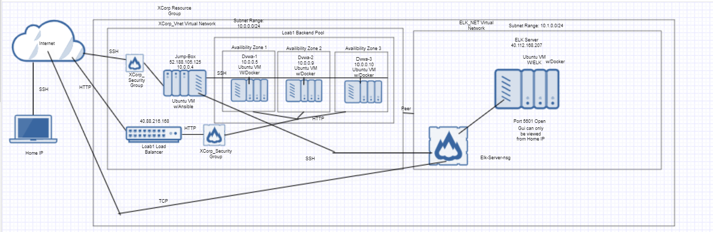

## Automated ELK Stack Deployment

The files in this repository were used to configure the network depicted below.

These files have been tested and used to generate a live ELK deployment on Azure.

  - ansibleplaybook.yml
  - installelk.yml
  - filebeat.yml

This document contains the following details:
- Description of the Topology
- Access Policies
- ELK Configuration
  - Beats in Use
  - Machines Being Monitored
- How to Use the Ansible Build

### Description of the Topology

The main purpose of this network is to expose a load-balanced and monitored instance of DVWA, the D*mn Vulnerable Web Application.

Load balancing ensures that the application will be highly available, in addition to restricting traffic to the network.

Integrating an ELK server allows users to easily monitor the vulnerable VMs for changes to the data system files. In conjunction with ELK, Filebeat monitors 
log files and specified locations and Metricbeat collects metrics and statistic it collects and ships them to Elasticsearch or Logstash. 

The configuration details of each machine may be found below.

| Name      | Function | IP Address    | Operating System |
|-----------|----------|---------------|------------------|
| Jump-Box  | Gateway  | 52.188.105.125| Linux            |
| DVWA-1    | Server   | 10.0.0.5      | Linux            |
| DVWA-2    | Server   | 10.0.0.9      | Linux            |
| DVWA-3    | Server   | 10.0.0.10     | Linux            |
| ELK-SERVER| ELK Stack| 40.112.168.207| Linux            |

### Access Policies

The machines on the internal network are not exposed to the public Internet. 

Only the Jump-Box machine can accept connections from the Internet. Access to this machine is only allowed from the following IP addresses:
- 73.22.162.36

Machines within the network can only be accessed by the Jump-Box, found at 52.188.105.125.

A summary of the access policies in place can be found in the table below.

| Name     | Publicly Accessible | Allowed IP Addresses       |
|----------|---------------------|----------------------------|
| Jump Box | No                  | 73.22.162.36               |
| DVWA's   | Yes                 | 40.88.216.168             |
|ELK-SERVER| No                  | 73.22.162.36 52.188.105.125|

### Elk Configuration

Ansible was used to automate configuration of the ELK machine. No configuration was performed manually, which is advantageous because it reduces 
human error and ensures the correct files are being applied.

The playbook implements the following tasks:
- Installs docker.io, python3-pip, and docker.
- Downloads and runs the sebp/elk:761 container, while indicating it should be started on specfici ports.
- Instructs the machine to use more memory 

### Target Machines & Beats
This ELK server is configured to monitor the following machines:
- 10.0.0.5
- 10.0.0.9 
- 10.0.0.10

We have installed the following Beats on these machines:
- Filebeat
- Metricbeat

These Beats allow us to collect the following information from each machine:
- Filebeat monitors logfiles and specified locations, collects log events, and then forwards them to Elasticsearch or Logstash. Once shipped, the data
can be indexed and centralized.

-Metricbeat periodically collects statistics from the OS and services running on a server. WIth these metrics, the server can be more efficiently 
and deeply monitored.

### Using the Playbook
In order to use the playbook, you will need to have an Ansible control node already configured. Assuming you have such a control node provisioned: 

SSH into the control node and follow the steps below:
- Copy the playbook file to /etc/ansible.
- Update the playbook file to include any necessary configurations, be them files or new orders.
- Run the playbook, and navigate to the machine it was used on to check that the installation worked as expected.

Playbooks are .yml files can should be copied to /etc/ansible. /etc/ansible/hosts should be altered to specify and/or add machines. Filebeat
changes should be made in its own cinfiguration file. To ensure that the ELK server is up and running, its kibana page should be accessed from a browser.

